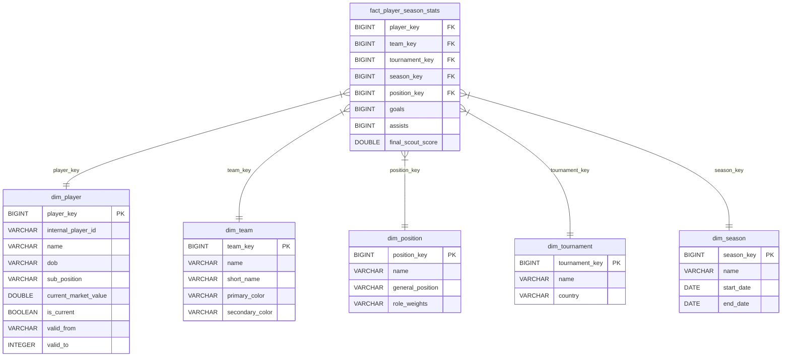

# Sơ đồ Quan hệ Thực thể (ERD) - Football Star Schema DWH

Sơ đồ này mô tả cấu trúc của mô hình **Star Schema** (Sơ đồ hình sao) được thiết lập trong kho dữ liệu **MotherDuck Cloud DWH** (Database: `football_data`).

> [!NOTE]  
> Tài liệu này được tạo tự động bởi công cụ `generate_erd.py` bằng cách trực tiếp truy vấn cấu trúc bảng (schema catalog) trên MotherDuck.

---

## 1. Bản vẽ Trực quan (Mermaid Diagram)

Bạn có thể xem trực tiếp bản vẽ này bằng cách sử dụng công cụ xem trước Markdown của VS Code (Phím tắt `Ctrl + Shift + V`) hoặc copy đoạn mã Mermaid dưới đây vào trang [Mermaid Live Editor](https://mermaid.live).



---

## 2. Chi tiết Cấu trúc Các Bảng (Schema Details)

### 📊 Bảng Fact (Bảng Sự kiện chính)
#### `fact_player_season_stats`
Bảng lưu trữ thông tin hiệu suất tổng hợp của cầu thủ qua từng mùa giải, được liên kết trực tiếp với các chiều qua các khóa Surrogate Key (`*_key`).
* **Các khóa liên kết ngoại (Foreign Keys)**: `player_key`, `team_key`, `position_key`, `tournament_key`, `season_key`.
* **Các chỉ số đo lường (Metrics)**: `goals`, `assists`, `final_scout_score`.

### 🗂️ Các Bảng Dimension (Bảng Chiều thông tin)
1. **`dim_player`**: Chứa thông tin chi tiết về từng cầu thủ, hỗ trợ lịch sử thay đổi thông tin (SCD Type 2).
2. **`dim_team`**: Thông tin về các câu lạc bộ bóng đá.
3. **`dim_position`**: Nhóm vị trí và vị trí chi tiết của cầu thủ.
4. **`dim_tournament`**: Các giải đấu giải vô địch quốc gia.
5. **`dim_season`**: Các mùa giải bóng đá.

---

## 3. Cách Kết Nối DBeaver Hoặc Công Cụ SQL Khác Để Xem ERD Tự Động

Ngoài việc sử dụng sơ đồ Mermaid ở trên, bạn có thể sử dụng các SQL Client chuyên nghiệp như **DBeaver** để tự động kết xuất ERD tương tác cực đẹp:

### Bước 1: Khởi tạo kết nối trong DBeaver
1. Mở **DBeaver**, chọn **Database** -> **New Database Connection**.
2. Chọn Driver là **DuckDB** hoặc **MotherDuck** (nếu có sẵn).
3. Tại ô **Path / Host URL**, nhập:
   ```text
   md:football_data?motherduck_token=YOUR_MOTHERDUCK_TOKEN
   ```
   *(Thay thế `YOUR_MOTHERDUCK_TOKEN` bằng mã token của bạn trong file `.env`)*

### Bước 2: Xem ERD của Star Schema
1. Kết nối thành công, bạn mở rộng thư mục `football_data` -> `main` -> `Tables`.
2. Giữ phím `Ctrl` và click chọn đồng thời cả 6 bảng:
   * `fact_player_season_stats`
   * `dim_player`
   * `dim_team`
   * `dim_position`
   * `dim_tournament`
   * `dim_season`
3. Click chuột phải chọn **View Diagram** (hoặc nhấn phím tắt `F4`). DBeaver sẽ tự động vẽ một sơ đồ thực thể liên kết vô cùng chuyên nghiệp giúp bạn kéo thả trực quan!
